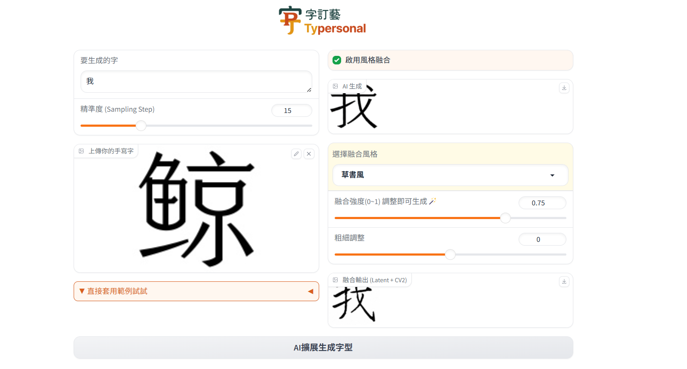

<div align=center>

# Typersonal: One-Shot Font Generation via Denoising Diffusion with Multi-Scale Content Aggregation and Style Contrastive Learning

</div>


<p align="center">
   <strong><a href="#🔥-model-zoo">🔥 Model Zoo </a></strong> •
   <strong><a href="#🛠️-installation">🛠️ Installation </a></strong> •
   <strong><a href="#🏋️-training">🏋️ Training</a></strong> •
   <strong><a href="#📺-sampling">📺 Sampling</a></strong> •
   <strong><a href="#📱-run-webui">📱 Run WebUI</a></strong>   
</p>


<!-- ## 📅 News -->

## 🔥 Model Zoo
| **Model**                                    | **checkpoint** | **status** |
|----------------------------------------------|----------------|------------|
| **Typersonal**                              | [GoogleDrive](https://drive.google.com/drive/folders/12hfuZ9MQvXqcteNuz7JQ2B_mUcTr-5jZ?usp=drive_link) / [BaiduYun:gexg](https://pan.baidu.com/s/19t1B7le8x8L2yFGaOvyyBQ) | Released  |
| **SCR**                                      | [GoogleDrive](https://drive.google.com/drive/folders/12hfuZ9MQvXqcteNuz7JQ2B_mUcTr-5jZ?usp=drive_link) / [BaiduYun:gexg](https://pan.baidu.com/s/19t1B7le8x8L2yFGaOvyyBQ) | Released     |


## 🛠️ Installation
### Prerequisites (Recommended)
- Linux
- Python 3.9
- Pytorch 1.13.1
- CUDA 11.7


### Environment Setup
Clone this repo:
```bash
git clone https://github.com/hollowha/typersonal.git
```

**Step 0**: Download and install Miniconda from the [official website](https://docs.conda.io/en/latest/miniconda.html).

**Step 1**: Create a conda environment and activate it.
```bash
conda create -n typersonal python=3.9 -y
conda activate typersonal
```

**Step 2**: Install related version Pytorch following [here](https://pytorch.org/get-started/previous-versions/).
```bash
# Suggested
pip install torch==1.13.1+cu117 torchvision==0.14.1+cu117 torchaudio==0.13.1 --extra-index-url https://download.pytorch.org/whl/cu117
```


**Step 3**: Install the required packages.
```bash
pip install -r requirements.txt
```

**Pip install following(if above cannnot worked)**
- transformers==4.33.1
- accelerate==0.23.0
- diffusers==0.22.0
- gradio==4.8.0
- pyyaml
- pygame
- opencv-python
- info-nce-pytorch
- kornia

<!-- ## 🏋️ Training
Training instructions...

## 📺 Sampling
Sampling instructions... -->

## 📱 Run WebUI
### (1) Sampling by Typersonal
```bash
python v10.py
```

**Example**:   
<p align="center">

</p>

<!-- ### (2) Sampling by Typersonal and Rendering by InstructPix2Pix
```bash
Coming Soon ...
``` -->

<!-- ## 🌄 Gallery
Gallery examples... -->

## 💙 Acknowledgement
- [diffusers](https://github.com/huggingface/diffusers)

## 🙌 Shoutout
This project, **Typersonal**, is heavily inspired by the amazing work of [**FontDiffuser**](https://github.com/yeungchenwa/FontDiffuser).  
A big shoutout to the original authors for pioneering one-shot font generation via diffusion!

## Copyright
- This repository can only be used for non-commercial research purposes.
- For commercial use, please contact Prof. Lianwen Jin (eelwjin@scut.edu.cn).
- Copyright 2023, [DLVC-Lab](http://www.dlvc-lab.net), South China University of Technology.

